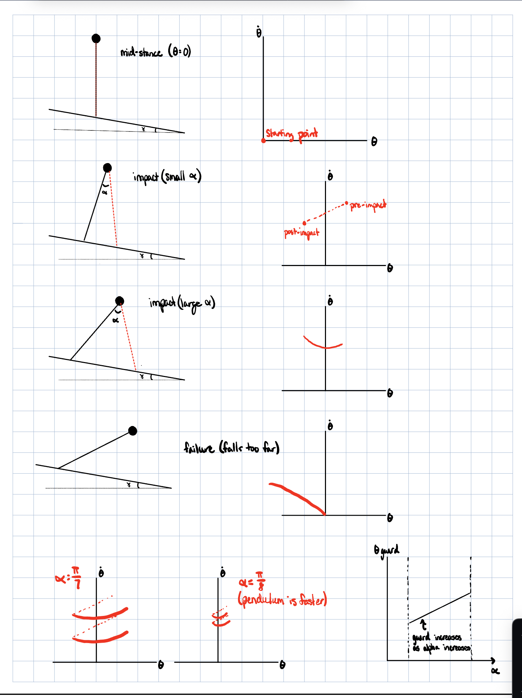
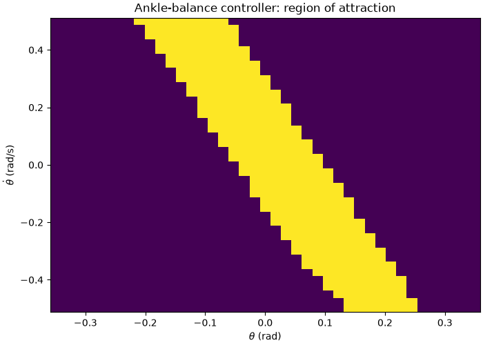
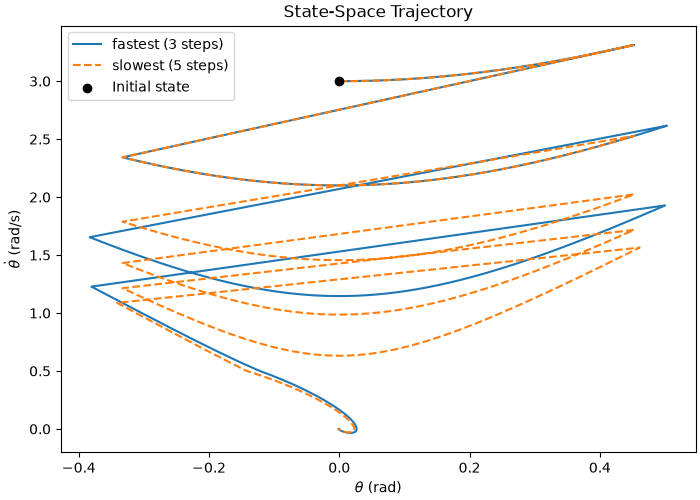
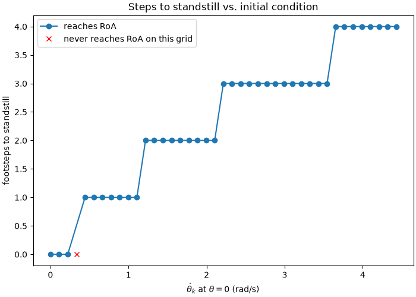

Assignment 2 — Inverted Pendulum Walker
1. Sketches

2. Region of Attraction (RoA) for the Ankle Controller

After implementing feedback linearization to cancel the pendulum dynamics and adding a damping term to stabilize the upright equilibrium, initial conditions were swept over a grid of (theta, theta_dot) pairs around the origin. Each grid point was simulated forward under the continuous ankle controller. The RoA is the set of initial conditions from which the trajectory converges to the upright equilibrium.

3. Choice of Poincaré Section

Since alpha is a control input, the touchdown event can no longer be used for the Poincaré Section like it was for the rimless wheel. In the rimless wheel, geometry fixed a single touchdown for a given slope, so sweeping theta_dot alone was enough to define a return map. For the inverted pendulum walker, theta at touchdown has guard conditions that shift with the chosen angle of attack. 
Instead, the section used is theta = 0 (mid-stance). This is good for a Poincaré section because it is transverse to the flow and every trajectory of interest crosses theta = 0 moving in one consistent direction. Also, it reduces to a single state because the only free coordinate left is the angular velocity so the return map is simply theta_dot_k to theta_dot_k+1 under a single control input u = alpha. 

4. Grid Resolution Verification

n (theta_ dot_axis)    Number of steps              unreachable states
                       (theta_dot_0 = 3 rad/s)      
3                       inf                         2/3
4                       2                           0/4
5                       3                           0/5
10                      3                           0/10
20                      3                           0/20

The theta_dot_axis of the step-to-step lookup table was taken at several resolutions n = 3, 4, 5, 10, 20 points and swept from 0 to the Froude-2 velocity. At each resolution with the initial condition theta_dot = 3.0 rad/s the number of steps to standstill and how many of the swept states the policy could bring to standstill are checked.

At n = 3, the grid is too coarse to represent the return map at all because two of its three points are classified as unable to ever reach the balance controller's region of attraction, which is qualitatively wrong. At n = 4, the table predicts 2 footsteps to standstill, which is one fewer than every finer grid. This is because the coarse spacing snaps the post-impact velocity to the wrong neighboring grid point. From n = 5 onward, every resolution we tested agrees exactly on 3 footsteps

5. Multi-Step Trajectory

6. Steps-to-Standstill Map

